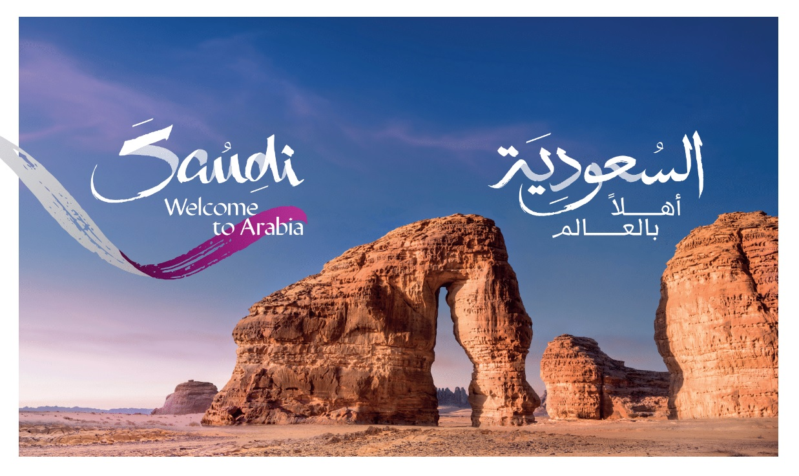

# Hotel Reviews NLP

 

Introduction:

As part of the Vision 2030 initiative, where the Kingdom aims to attract 100 million visitors annually, which requires a significant increase in the stock of hotel rooms, as the national transformation programs within the framework of developing the tourism sector and national heritage are keen to make the Kingdom a regional and global tourist destination, and the goal of this project is Building unsupervised machine learning models for Arabic Natural Language Processing (NLP) that determine whether a text revision is a positive revision or a negative revision. This project will help hotels to automatically identify and group text review category to improve their services.

Problem Statement:

The Saudi Ministry of Tourism (MT)is a governmental body concerned with tourism. It is focused on encouraging and supporting domestic and external tourism through sponsoring and conducting tourism events across the country and overcoming obstacles to growth of tourism.DS Company will analyze whether the text review is a positive review or a negative review. This project will help hotels to automatically identify and group text review category to improve their services

Question\Need:

What are the most words positive repeated?

What are the most words negative repeated?

Data Description

We will be using the " To analyze user reviews of hotels " Dataset from Kaggle: the dataset has 2000 numbers of rows and 4 feature

Columns: 

Reviews: Reviews text.

Rating: User sentiment, Negative, Positive

Hotel:  Hotel Name 

Users Number: user ID

Tools:

Technologies: python, Jupyter notebook

Libraries: pandas, numpy, matplotlib, seaborn, LogisticRegression , WordCloud, STOPWORDS, textblob, tqdm, arabic_reshaper, nltk, farasa, sklearn, pyLDAvis
